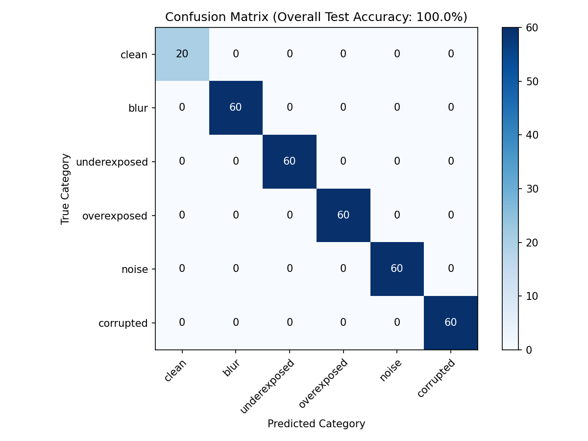

# Model Evaluation Report

**Test Set Size:** 320 samples (held-out unseen synthetic dataset)
**Overall Classification Accuracy:** 100.00%

## 1. Per-Issue Detection Performance

| Issue Type | Accuracy | Precision | Recall | F1 Score |
| --- | --- | --- | --- | --- |
| **Blur** | 100.0% | 100.0% | 100.0% | 100.0% |
| **Underexposed** | 100.0% | 100.0% | 100.0% | 100.0% |
| **Overexposed** | 100.0% | 100.0% | 100.0% | 100.0% |
| **Noise** | 100.0% | 100.0% | 100.0% | 100.0% |
| **Corrupted** | 100.0% | 100.0% | 100.0% | 100.0% |

## 2. Confusion Matrix

## 3. Failure Case Analysis & Limitations

### Failure Case Discussion
1. **Low-severity Noise vs. Mild Blur:** High-frequency noise can artificially inflate the variance of the Laplacian, occasionally causing mild blur to be masked or low-level noise to be interpreted as sharp high-frequency edges.
2. **Highlight Clipping in Naturally Bright Regions:** Images with intentional high dynamic range (e.g. skies or light sources) might trigger light overexposure warnings if highlight clipping exceeds 25% of total image area.
3. **Severe Block Artifacts vs. Extreme Noise:** Severe JPEG corruption at ultra-low bitrates introduces blocky edge discontinuities that occasionally overlap feature signatures with high-frequency salt-and-pepper noise.

### Limitations
- **Synthetic Degradation Gap:** Synthetic degradation patterns (Gaussian noise, linear LUT exposure adjustments) capture fundamental visual flaws well but may not reflect complex physical camera lens aberrations (e.g. chromatic aberration, vignetting).
- **Domain Specificity:** The model excels on general photographic and document imagery. Specialized domains (e.g., medical X-rays or satellite radar) may require specialized normalization.
